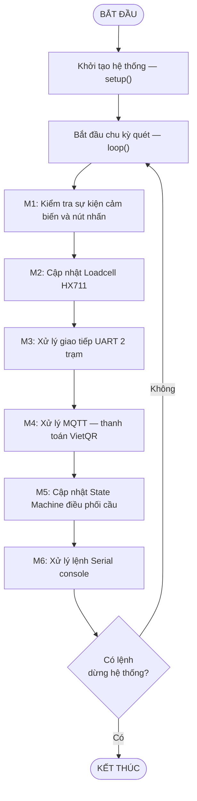
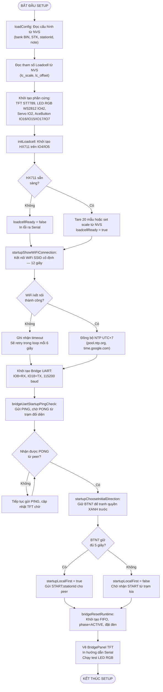
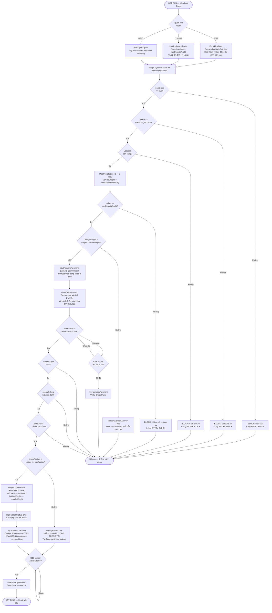
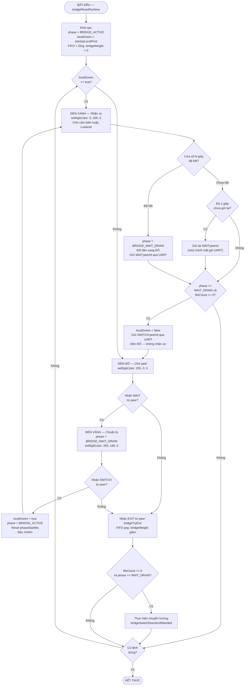
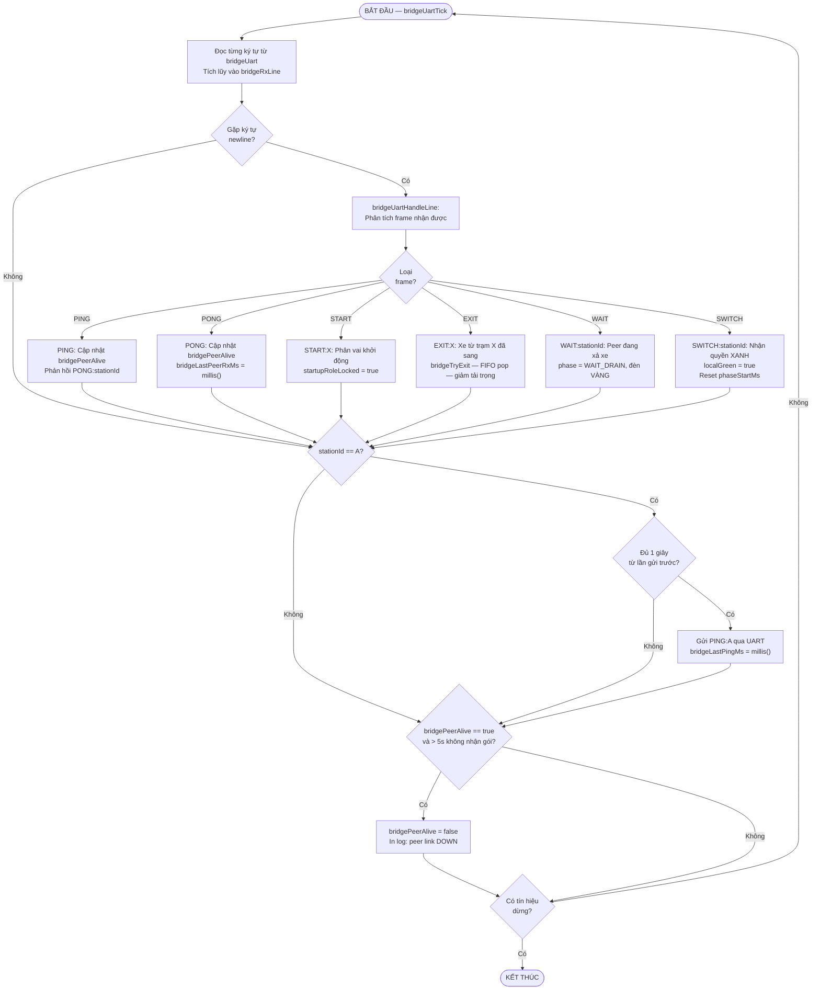

# LƯU ĐỒ THUẬT TOÁN — HỆ THỐNG GATE IOT 2 TRẠM

> Áp dụng Quy Tắc Vàng: Chuẩn hình khối • Khép kín vòng lặp • Chia nhỏ Module • Bắt buộc diễn giải bằng lời

---

## Hình 1. Giải Thuật Chính Hệ Thống (Tổng Quát)

### Mô tả nguyên lý hoạt động

Hệ thống khởi động qua hàm `setup()`, thực hiện tuần tự toàn bộ các bước khởi tạo phần cứng và thiết lập kết nối. Sau khi hoàn tất, chương trình chuyển sang hàm `loop()` chạy liên tục theo chu kỳ quét.

Mỗi chu kỳ, hệ thống tuần tự xử lý 6 module chức năng: **(M1)** kiểm tra sự kiện từ các cảm biến IO16/IO15/IO17 và nút BTN7; **(M2)** đọc giá trị cân Loadcell HX711 định kỳ 300ms; **(M3)** nhận/gửi frame UART vật lý giữa 2 trạm A–B; **(M4)** duy trì kết nối WiFi và MQTT để xử lý callback thanh toán SePay; **(M5)** cập nhật bộ máy trạng thái điều phối quyền ưu tiên qua cầu; **(M6)** xử lý lệnh điều khiển nhập từ Serial console.

Khối điều kiện "Có lệnh dừng hệ thống?" ở cuối vòng lặp trong thực tế luôn trả về **Không** (không có cơ chế dừng phần cứng), tạo thành chu kỳ quét vô hạn, đảm bảo hệ thống phản ứng theo thời gian thực.

---

## Hình 2. Giải Thuật Module Khởi Động — setup()

### Mô tả nguyên lý hoạt động

Quá trình khởi động diễn ra tuần tự theo từng lớp từ phần cứng đến mạng và giao thức.

Đầu tiên, hệ thống đọc toàn bộ cấu hình từ bộ nhớ NVS (Non-Volatile Storage) gồm thông tin tài khoản VietQR, ID trạm (A hoặc B), và tham số calibration của cân Loadcell. Tiếp theo, tất cả phần cứng được khởi tạo: màn hình TFT, dải LED RGB, servo barie, và các AceButton cho 4 đầu vào cảm biến.

Với HX711 Loadcell: nếu chip **không sẵn sàng** (sai dây hoặc mất nguồn), hệ thống đặt cờ `loadcellReady = false` và in lỗi, nhưng **không dừng khởi động** — hệ thống vẫn tiếp tục, cho phép sử dụng lệnh `LC REINIT` sau. Nếu **sẵn sàng**, hệ thống tare hoặc áp dụng scale đã lưu.

Kết nối WiFi được thử trong 12 giây: nếu **thành công**, đồng bộ đồng hồ NTP để có timestamp cho log Google Sheets; nếu **thất bại**, hệ thống tiếp tục và tự retry mỗi 6 giây trong vòng lặp chính.

Giai đoạn quan trọng nhất là **kiểm tra kết nối 2 trạm**: trạm A gửi PING định kỳ, trạm B lắng nghe và phản hồi PONG. Vòng lặp `N -- Không --> O --> N` thể hiện hệ thống **block tại đây cho đến khi 2 trạm nhận ra nhau**, đảm bảo không có trạm nào hoạt động độc lập khi cấu hình 2 trạm.

Cuối cùng, người vận hành **giữ BTN7 đủ 5 giây** để tranh quyền bật đèn XANH trước. Trạm nào nhấn trước sẽ gửi `START:<stationId>`, trạm còn lại nhận và nhường đèn ĐỎ. Sau khi phân vai xong, `bridgeResetRuntime()` khởi tạo toàn bộ state machine và hệ thống chuyển sang vòng lặp chính.

---

## Hình 3. Giải Thuật Vòng Lặp Chính — loop()

```mermaid
flowchart TD
    S([BẮT ĐẦU CHU KỲ QUÉT])
    A["AceButton.check() cho 4 đầu vào:\nIO16 Loadcell, IO15 Barie, IO17 Exit, IO7 BTN"]
    B{"Có sự kiện\ncảm biến?"}
    C["handleInputEvent: Xử lý sự kiện\n(PRESSED / RELEASED / LONG_PRESSED)"]
    D["updateLoadcell: Đọc HX711 nếu đủ 300ms"]
    E{"Trọng lượng >=\nngưỡng phát hiện?"}
    F["lcTriggered = true\nGọi bridgeTryEntry - LOADCELL"]
    G["bridgeUartTick: Nhận ký tự từ UART peer"]
    H{"Nhận đủ frame\nUART mới?"}
    I["bridgeUartHandleLine:\nXử lý PING/PONG/EXIT/WAIT/SWITCH"]
    J["mqttTick: ensureWiFi + ensureMQTT + mqttClient.loop()"]
    K{"MQTT có\nmessage mới?"}
    L["mqttCallback → handleMqttPaymentPayload"]
    M{"Pending payment\n> 120 giây?"}
    N["Hủy pendingPayment\nVẽ lại BridgePanel"]
    O{"IO16 timer đủ\n700ms?"}
    P["pendingBarieEntryMs = 0\nGọi bridgeTryEntry - IO16"]
    Q["bridgeTick: Kiểm tra hết window N giây\nwaitingEntry auto-commit\nVẽ TFT định kỳ"]
    R{"Có ký tự\ntrên Serial?"}
    T["processSerialIfAvailable → handleCommandLine"]
    STOP{"Có tín hiệu\ndừng?"}
    END([KẾT THÚC])

    S --> A --> B
    B -- Có --> C --> D
    B -- Không --> D
    D --> E
    E -- Có --> F --> G
    E -- Không --> G
    G --> H
    H -- Có --> I --> J
    H -- Không --> J
    J --> K
    K -- Có --> L --> M
    K -- Không --> M
    M -- Có --> N --> O
    M -- Không --> O
    O -- Có --> P --> Q
    O -- Không --> Q
    Q --> R
    R -- Có --> T --> STOP
    R -- Không --> STOP
    STOP -- Không --> S
    STOP -- Có --> END
```

### Mô tả nguyên lý hoạt động

Vòng lặp `loop()` là trung tâm điều hành của toàn bộ hệ thống, chạy liên tục không ngắt nghỉ với tốc độ hàng trăm lần mỗi giây.

**Giai đoạn 1 — Cảm biến:** Bốn đối tượng AceButton được polling. Khi phát hiện sự kiện thay đổi trạng thái (nhấn/nhả/giữ lâu), `handleInputEvent()` được gọi ngay lập tức để xử lý đúng loại tín hiệu.

**Giai đoạn 2 — Loadcell:** `updateLoadcell()` chỉ đọc HX711 khi đủ 300ms từ lần đọc trước (tránh blocking). Nếu trọng lượng vượt ngưỡng `minDetectWeight` và đã ổn định 1 giây (lcSettled), hệ thống tự động kích hoạt luồng xe vào.

**Giai đoạn 3 — UART:** Đọc từng ký tự từ `bridgeUart` và tích lũy vào buffer. Khi gặp ký tự `\n` (kết thúc frame), toàn bộ frame được phân tích để xử lý lệnh PING/PONG/EXIT/WAIT/SWITCH từ trạm đối diện.

**Giai đoạn 4 — MQTT:** Gọi `mqttClient.loop()` để xử lý các message đến. Khi SePay gửi webhook xác nhận thanh toán, callback `mqttCallback()` được kích hoạt ngay trong giai đoạn này.

**Giai đoạn 5 — Bộ định thời:** Kiểm tra hai timer: (a) nếu QR đang chờ quá 120 giây mà chưa được quét — hủy giao dịch; (b) nếu IO16 đã phát hiện xe đủ 700ms — đọc cân và tiến hành entry.

**Giai đoạn 6 — State Machine:** `bridgeTick()` kiểm tra xem cửa sổ thời gian N giây đã hết chưa, có xe đã thanh toán đang chờ vào không, và cập nhật màn hình TFT.

Mũi tên `STOP -- Không --> S` thể hiện chu trình quét vô tận, đặc trưng của hệ thống nhúng thời gian thực.

---

## Hình 4. Giải Thuật Phát Hiện Xe và Thanh Toán VietQR

### Mô tả nguyên lý hoạt động

Luồng phát hiện xe và thanh toán là luồng nghiệp vụ trung tâm, được kích hoạt từ 3 nguồn khác nhau.

**Nguồn 1 — IO16 (tự động):** Khi cảm biến vật lý tại vị trí cân phát hiện xe, hệ thống không đọc cân ngay mà chờ thêm 700ms để xe ổn định trên bàn cân trước khi đọc giá trị chính xác.

**Nguồn 2 — Loadcell auto-detect:** Module `updateLoadcell()` liên tục giám sát giá trị cân. Khi trọng lượng smooth vượt ngưỡng `minDetectWeight` (50g) và đã ổn định liên tục >= 1 giây, hệ thống tự động kích hoạt. Cơ chế này bổ sung cho IO16 trong trường hợp cảm biến vật lý gặp sự cố.

**Nguồn 3 — BTN7 thủ công:** Người vận hành giữ nút 5 giây để xác nhận thủ công, dùng trong trường hợp test hoặc xe không lên cân đúng cách.

**Chuỗi kiểm tra điều kiện** trong `bridgeTryEntry()` thực hiện 4 kiểm tra lồng nhau: (1) đèn phải XANH; (2) đang ở pha ACTIVE không phải xả xe; (3) cảm biến cân hoạt động; (4) trọng lượng đủ lớn để nhận diện là xe thật. Nếu **bất kỳ điều kiện nào sai** — luồng kết thúc với BLOCK, không tạo giao dịch.

**Kiểm tra tải trọng:** Nếu cầu đã đầy tải, hệ thống **không từ chối xe** mà chuyển sang chế độ `waitingEntry`, tức là xe đã được phép thanh toán nhưng barie chưa mở — hệ thống sẽ tự động mở barie khi có xe khác ra khỏi cầu giải phóng tải trọng.

**Thanh toán VietQR:** Mã QR được tạo theo chuẩn EMVCo với payload chứa thông tin ngân hàng, số tài khoản, số tiền và mã giao dịch DH########. Hệ thống chờ webhook từ SePay qua MQTT. Khi nhận được, 4 lớp xác thực được kiểm tra: loại giao dịch, mã khớp, số tiền đủ, và tải trọng cầu. Sau khi thành công, FIFO được cập nhật, barie mở, và log được ghi bất đồng bộ lên Google Sheets qua FreeRTOS task riêng.

---

## Hình 5. Giải Thuật State Machine Điều Phối Cầu

### Mô tả nguyên lý hoạt động

State Machine điều phối cầu là thuật toán quyết định **ai được phép cho xe vào** tại mỗi thời điểm, đảm bảo mutual exclusion giữa hai chiều lưu thông.

**Giai đoạn XANH (BRIDGE_ACTIVE + localGreen=true):** Trạm đang có quyền ưu tiên, đèn XANH, barie có thể mở. Trong giai đoạn này, bộ đếm thời gian cửa sổ N giây (mặc định 120s) đang chạy. Hệ thống tiếp tục nhận xe miễn là còn tải trọng và còn thời gian.

**Chuyển sang xả xe:** Khi cửa sổ N giây hết, hệ thống chuyển `phase = BRIDGE_WAIT_DRAIN`, đèn đổi sang ĐỎ, và gửi lệnh `WAIT:<peerId>` cho trạm đối diện. Lệnh WAIT được gửi lại mỗi 2 giây như cơ chế retry, tránh trường hợp gói UART bị mất khiến trạm đối diện bị kẹt ĐỎ mãi.

**Điều kiện chuyển hướng:** Hệ thống chỉ thực sự nhường quyền khi `fifoCount == 0` — tức là **không còn xe nào đang trên cầu**. Khi đó `SWITCH:<peerId>` được gửi đi, trạm này về ĐỎ hoàn toàn.

**Giai đoạn ĐỎ (localGreen=false):** Trạm đang chờ. Khi nhận `WAIT`, đổi sang VÀNG (báo hiệu sắp được chuyển). Khi nhận `SWITCH`, chuyển về XANH và bắt đầu cửa sổ N giây mới.

**Sự kiện EXIT:** Bất cứ khi nào nhận được `EXIT` từ peer (xe đã sang đến trạm đối diện), FIFO được pop và tải trọng cầu giảm. Nếu sau EXIT mà cầu vừa trống và đang ở pha WAIT_DRAIN — chuyển hướng ngay lập tức mà không cần chờ tiếp.

---

## Hình 6. Giải Thuật Giao Tiếp UART Giữa 2 Trạm

### Mô tả nguyên lý hoạt động

Module giao tiếp UART là dây thần kinh kết nối 2 trạm A–B, sử dụng cổng `HardwareSerial(1)` trên chân IO8 (RX) và IO18 (TX) với tốc độ 115200 baud.

**Cơ chế nhận frame:** Hệ thống đọc từng ký tự và tích lũy vào buffer chuỗi `bridgeRxLine`. Khi gặp ký tự xuống dòng `\n`, toàn bộ chuỗi được đưa vào hàm phân tích `bridgeUartHandleLine()`. Buffer bị giới hạn 120 ký tự để tránh tràn bộ nhớ.

**Xử lý từng loại frame:**
- `PING` — Trạm A gửi mỗi 1 giây; trạm B nhận và phản hồi `PONG` ngay lập tức, đồng thời cập nhật timestamp `bridgeLastPeerRxMs`.
- `PONG` — Trạm A nhận, cập nhật trạng thái `bridgePeerAlive = true`.
- `START:X` — Dùng trong giai đoạn khởi động để phân vai ai được XANH trước.
- `EXIT:X` — Báo xe từ trạm X đã sang trạm đối diện. Trạm nhận thực hiện `bridgeTryExit()`: pop FIFO, giảm `bridgeWeight`, kiểm tra xem có nên chuyển hướng không.
- `WAIT:X` — Trạm đang XANH thông báo sắp nhường quyền. Trạm X nhận tín hiệu, chuyển đèn VÀNG, chuẩn bị nhận `SWITCH`.
- `SWITCH:X` — Cầu đã trống, trạm X được nhận quyền XANH. Trạm X reset bộ đếm cửa sổ thời gian và bắt đầu chu kỳ mới.

**Heartbeat và phát hiện lỗi:** Chỉ **trạm A** chủ động gửi PING mỗi 1 giây. Nếu hệ thống không nhận bất kỳ gói nào từ peer trong vòng **5 giây liên tiếp**, cờ `bridgePeerAlive` được hạ xuống `false`. Trạng thái này hiển thị trên TFT và Serial để người vận hành biết link đã bị mất — tuy nhiên hiện tại firmware **chưa có cơ chế fail-safe tự động** (đặt đèn ĐỎ cả 2 trạm) khi link down, đây là điểm cần hoàn thiện.

---

## Tổng Kết Phân Tầng Lưu Đồ

| Hình | Tên module | Mức độ chi tiết |
|------|-----------|----------------|
| Hình 1 | Giải thuật tổng quát | Kiến trúc hệ thống |
| Hình 2 | Module khởi động setup() | Trình tự khởi tạo |
| Hình 3 | Vòng lặp chính loop() | Chu kỳ quét thời gian thực |
| Hình 4 | Phát hiện xe và thanh toán VietQR | Luồng nghiệp vụ chính |
| Hình 5 | State Machine điều phối cầu | Logic phân quyền |
| Hình 6 | Giao tiếp UART 2 trạm | Giao thức truyền thông |
