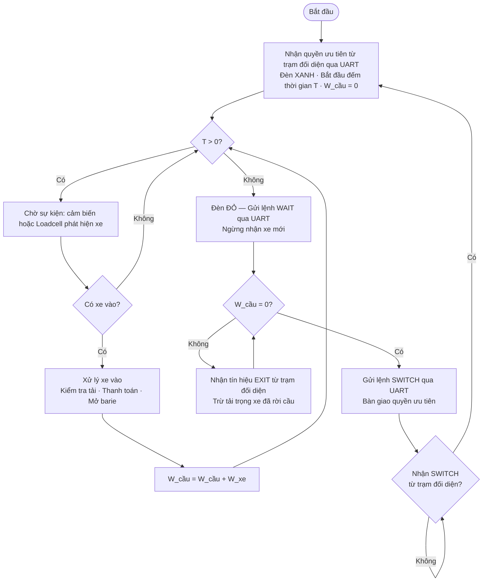
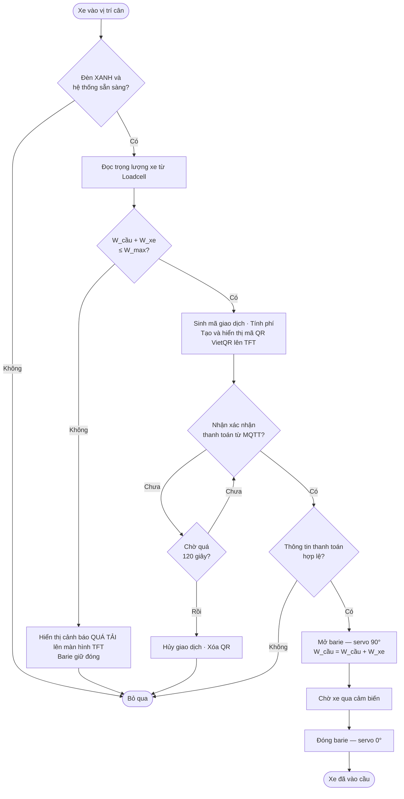
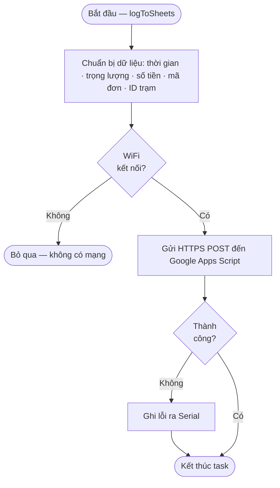

# LƯU ĐỒ THUẬT TOÁN — HỆ THỐNG GATE IOT

> Áp dụng Quy Tắc Vàng: Chuẩn hình khối • Khép kín vòng lặp • Chia nhỏ Module • Bắt buộc diễn giải bằng lời

---

## Hình 1. Giải Thuật Điều Phối Cầu

### Mô tả nguyên lý hoạt động

Hệ thống bắt đầu chu kỳ khi nhận quyền ưu tiên từ trạm đối diện qua UART: đèn chuyển XANH, bộ đếm thời gian T khởi động, tải trọng cầu về 0.

Trong thời gian T còn lại (**T > 0 — Có**), hệ thống liên tục polling chờ xe. Khi **phát hiện xe (Có)**, luồng xử lý xe được kích hoạt (thanh toán, mở barie), sau đó cộng tải trọng vào W_cầu rồi quay lại kiểm tra T. Nếu **chưa có xe (Không)**, vòng lặp tiếp tục chờ.

Khi T về 0 (**T > 0 — Không**), đèn chuyển ĐỎ và lệnh WAIT được gửi qua UART. Hệ thống chuyển sang giai đoạn xả cầu: liên tục nhận tín hiệu EXIT từ trạm đối diện để trừ tải. Khi **W_cầu = 0 (Có)** — cầu hoàn toàn trống — lệnh SWITCH được gửi đi để bàn giao quyền. Hệ thống chờ nhận lại SWITCH từ trạm kia trước khi bắt đầu chu kỳ mới, tạo thành vòng luân phiên khép kín.

---

## Hình 2. Giải Thuật Thanh Toán MQTT VietQR

### Mô tả nguyên lý hoạt động

Luồng bắt đầu khi xe vào vị trí cân. Điều kiện tiên quyết là **đèn phải XANH và hệ thống sẵn sàng (Có)**; nếu **Không**, bỏ qua toàn bộ.

Hệ thống đọc trọng lượng xe và kiểm tra tải trọng tổng. Nếu **vượt ngưỡng W_max (Không)**, hiển thị cảnh báo quá tải và kết thúc. Nếu **còn dư tải (Có)**, sinh mã giao dịch, tính phí và vẽ mã QR VietQR lên màn hình TFT.

Hệ thống vào vòng chờ callback từ MQTT. Nếu **chưa nhận được xác nhận**, kiểm tra timeout 120 giây: nếu **chưa đủ** thì tiếp tục chờ; nếu **đã quá 120 giây**, hủy giao dịch. Khi **nhận được callback (Có)**, dữ liệu thanh toán được xác thực; nếu **không hợp lệ** thì bỏ qua, nếu **hợp lệ** thì mở barie, cập nhật tải trọng, chờ xe qua cảm biến rồi đóng barie — kết thúc luồng.

---

## Hình 3. Giải Thuật Ghi Log Google Sheets

### Mô tả nguyên lý hoạt động

Hàm `logToSheets()` được gọi sau mỗi lần xe vào cầu thành công, chạy trong **FreeRTOS task riêng** để không block vòng lặp chính.

Hệ thống thu thập dữ liệu giao dịch rồi kiểm tra WiFi. Nếu **không có mạng (Không)**, bỏ qua hoàn toàn. Nếu **có mạng (Có)**, gửi HTTP POST đến Google Apps Script. Nếu **thất bại (Không)**, ghi lỗi ra Serial. Dù thành công hay thất bại, task đều tự kết thúc và giải phóng bộ nhớ.
